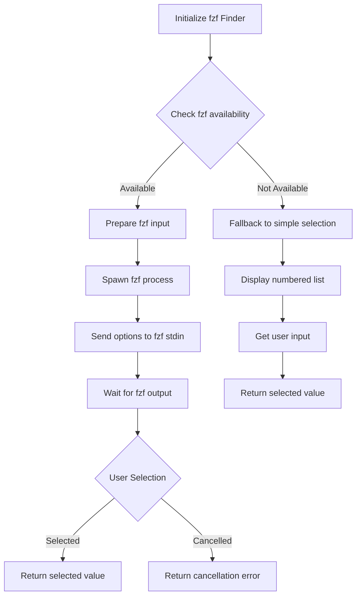
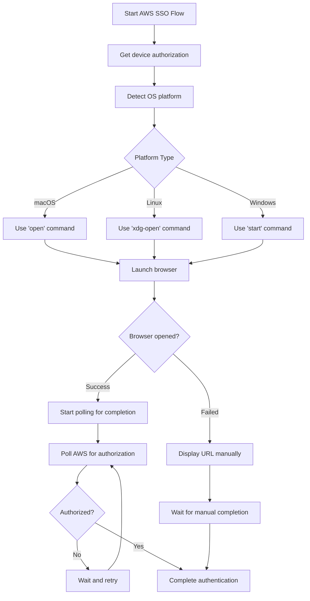

# Design Document

## Overview

This design enhances the AWS authentication capabilities of synacklab by restructuring the command interface and implementing an interactive fuzzy finder. The enhancement separates authentication concerns from context switching and provides a modern, user-friendly selection interface similar to fzf.

The design builds upon the existing AWS SSO authentication flow in `aws_config.go` and the current fuzzy finder in `pkg/fuzzy/fuzzy.go`, extending them to provide better separation of concerns and improved user experience.

## Architecture

### Command Structure Changes

The current command structure will be modified as follows:

**Current:**
```
synacklab auth
└── config  (Set default AWS profile)
```

**New:**
```
synacklab auth
├── aws-login (New: AWS SSO authentication only)
└── aws-ctx   (Renamed from config: Context switching with auto-auth)
```

### Authentication Flow Architecture

```mermaid
graph TD
    A[User runs aws-ctx] --> B{Check AWS Auth Status}
    B -->|Not Authenticated| C[Display "Not authenticated" message]
    C --> D[Auto-trigger aws-login flow]
    D --> E[AWS SSO Device Flow]
    E --> F[Auto-open browser]
    F --> G[Poll for completion]
    G --> H{Authorization Complete?}
    H -->|No| I[Wait and retry]
    I --> G
    H -->|Yes| J[Store credentials]
    J --> K[Continue to context selection]
    B -->|Authenticated| K
    K --> L[fzf-based Fuzzy Finder]
    L --> M[Update default profile]
```

### fzf-based Fuzzy Finder Architecture



### Browser Opening Architecture



## Components and Interfaces

### 1. Authentication Manager

**Location:** `internal/auth/manager.go`

```go
type AuthManager interface {
    // IsAuthenticated checks if user has valid AWS SSO credentials
    IsAuthenticated(ctx context.Context) (bool, error)
    
    // Authenticate performs AWS SSO device flow authentication with automatic browser opening
    Authenticate(ctx context.Context, config *config.Config) (*SSOSession, error)
    
    // GetStoredCredentials retrieves cached authentication credentials
    GetStoredCredentials() (*SSOSession, error)
    
    // ClearCredentials removes stored authentication credentials
    ClearCredentials() error
}

type SSOSession struct {
    AccessToken string
    StartURL    string
    Region      string
    ExpiresAt   time.Time
}

// BrowserOpener handles opening URLs in the default browser
type BrowserOpener interface {
    Open(url string) error
}
```

### 2. fzf-based Fuzzy Finder

**Location:** `pkg/fuzzy/fzf.go`

```go
type FzfFinder interface {
    // SetOptions sets the available options for selection
    SetOptions(options []Option) error
    
    // SetPrompt sets the display prompt
    SetPrompt(prompt string)
    
    // Select starts the fzf selection process
    Select() (string, error)
    
    // SetPreviewCommand sets a preview command for fzf
    SetPreviewCommand(cmd string)
}

type Option struct {
    Value       string
    Description string
    Metadata    map[string]string
}

// BrowserOpener handles opening URLs in the default browser
type BrowserOpener interface {
    Open(url string) error
}
```

### 3. Command Handlers

**Location:** `internal/cmd/aws_login.go` and `internal/cmd/aws_ctx.go`

```go
// AWS Login Command Handler with automatic browser opening
func runAWSLogin(cmd *cobra.Command, args []string) error

// AWS Context Command Handler with optional --no-auth flag
func runAWSCtx(cmd *cobra.Command, args []string) error

// Browser opener for cross-platform URL opening
type BrowserOpener struct{}
func (b *BrowserOpener) Open(url string) error
```

## Data Models

### Authentication State

```go
type AuthState struct {
    IsAuthenticated bool
    Session         *SSOSession
    LastCheck       time.Time
    Error           error
}
```

### Profile Information

```go
type ProfileInfo struct {
    Name        string
    AccountID   string
    AccountName string
    RoleName    string
    Region      string
    IsDefault   bool
}
```

### Fuzzy Finder State

```go
type FinderState struct {
    Options         []Option
    FilteredOptions []Option
    SelectedIndex   int
    FilterText      string
    DisplayOffset   int
}
```

## Error Handling

### Authentication Errors

1. **Network Connectivity Issues**
   - Detect network timeouts and connection failures
   - Provide clear error messages with retry suggestions
   - Implement exponential backoff for retries

2. **AWS SSO Session Expiry**
   - Detect expired tokens during API calls
   - Automatically clear invalid credentials
   - Prompt user to re-authenticate

3. **Invalid Configuration**
   - Validate SSO start URL and region
   - Provide helpful error messages for common misconfigurations
   - Guide users to correct configuration format

### Fuzzy Finder Errors

1. **Terminal Compatibility**
   - Detect terminal capabilities for interactive features
   - Fallback to simple selection for unsupported terminals
   - Handle terminal resize events gracefully

2. **Input Validation**
   - Handle invalid key sequences
   - Prevent crashes from unexpected input
   - Provide clear feedback for invalid selections

### Command Execution Errors

1. **Missing Dependencies**
   - Check for required AWS configuration
   - Validate profile existence before operations
   - Provide clear setup instructions

2. **Permission Issues**
   - Handle file system permission errors
   - Provide clear error messages for config file access
   - Suggest solutions for common permission problems

## Testing Strategy

### Unit Tests

1. **Authentication Manager Tests**
   - Mock AWS SSO API responses
   - Test credential storage and retrieval
   - Test session expiry detection
   - Test error handling scenarios

2. **Interactive Fuzzy Finder Tests**
   - Test filtering algorithms
   - Test keyboard navigation logic
   - Test terminal interaction mocking
   - Test edge cases (empty lists, single items)

3. **Command Handler Tests**
   - Test command argument parsing
   - Test integration with authentication manager
   - Test error propagation and handling
   - Test backward compatibility scenarios

### Integration Tests

1. **End-to-End Authentication Flow**
   - Test complete aws-login command execution
   - Test aws-ctx command with and without authentication
   - Test credential persistence across command invocations

2. **Fuzzy Finder Integration**
   - Test fuzzy finder with real AWS profile data
   - Test filtering with various input patterns
   - Test selection and result handling

3. **AWS Config File Integration**
   - Test profile reading from ~/.aws/config
   - Test default profile setting
   - Test handling of malformed config files

### Performance Tests

1. **Large Profile Lists**
   - Test fuzzy finder performance with 100+ profiles
   - Test filtering performance with large datasets
   - Test memory usage with extensive profile lists

2. **Authentication Performance**
   - Test AWS SSO API call performance
   - Test credential caching effectiveness
   - Test startup time with cached credentials

## Implementation Phases

### Phase 1: Authentication Manager (Completed)
- Extract authentication logic from aws_config.go ✓
- Implement credential storage and validation ✓
- Add session expiry detection ✓
- Create unit tests for authentication manager ✓

### Phase 2: Interactive Fuzzy Finder (Completed - needs fzf replacement)
- Implement terminal-based interactive interface ✓
- Add real-time filtering capabilities ✓
- Implement keyboard navigation ✓
- Add graceful fallback for unsupported terminals ✓

### Phase 3: Command Restructuring (Completed)
- Create aws-login command ✓
- Rename config command to aws-ctx ✓
- Implement auto-authentication in aws-ctx ✓
- Update help text and documentation ✓

### Phase 4: Browser Integration and fzf Enhancement (New)
- Implement automatic browser opening for AWS SSO
- Add polling mechanism for authorization completion
- Replace custom fuzzy finder with fzf library integration
- Add --no-auth flag to aws-ctx command
- Cross-platform browser opening support

### Phase 5: Integration and Testing
- Integrate all components
- Add comprehensive error handling
- Implement integration tests for new features
- Performance optimization and testing

## Security Considerations

1. **Credential Storage**
   - Store credentials in secure OS-specific locations
   - Implement proper file permissions for credential files
   - Clear credentials on authentication failures

2. **Token Handling**
   - Never log authentication tokens
   - Implement secure token validation
   - Handle token refresh gracefully

3. **Input Validation**
   - Sanitize all user inputs
   - Validate AWS configuration parameters
   - Prevent injection attacks through profile names

## Backward Compatibility

The design maintains backward compatibility by:
- Preserving AWS config file format and location
- Maintaining existing configuration file structure
- Ensuring AWS profile data remains accessible